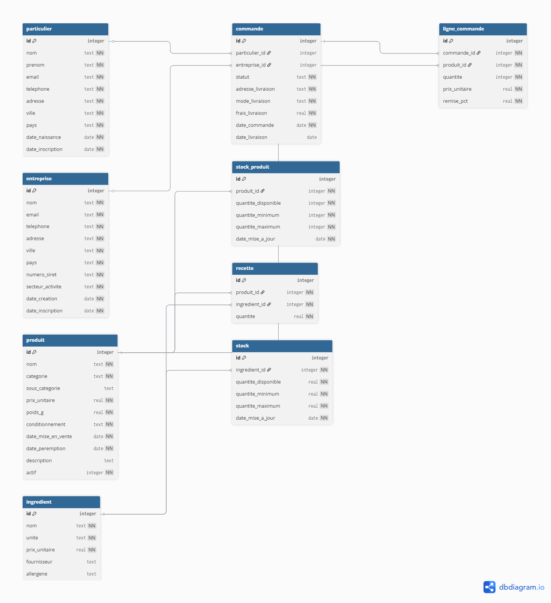

# DESIGN.md — Sweet Factory

## Diagramme Entité-Relation



---

## Description des entités

### `particulier`
Représente un client individuel qui commande sur le site. On stocke ses coordonnées complètes et sa date de naissance (utile pour des offres d'anniversaire par exemple).

### `entreprise`
Représente un client professionnel (épiceries fines, restaurants, revendeurs...). On stocke son numéro SIRET pour l'identification légale et son secteur d'activité pour adapter les offres commerciales.

### `commande`
Représente une commande passée par un client — particulier ou entreprise. Elle contient les informations de livraison et le statut de la commande. Une commande est toujours liée à **un seul client**.

### `ligne_commande`
Représente le détail d'une commande : quel produit, en quelle quantité, à quel prix, avec quelle remise. Une commande peut contenir plusieurs lignes.

### `produit`
Représente un article vendu par Sweet Factory (chocolat, bonbon, biscuit). Il contient le prix, le poids, le conditionnement et une date de péremption.

### `stock_produit`
Représente le stock de produits finis disponibles à l'expédition. Permet de savoir si une commande peut être honorée immédiatement depuis le stock existant, ou si une nouvelle production doit être lancée. Lié directement à `produit` — un produit a exactement un stock.

### `ingredient`
Représente une matière première utilisée dans la fabrication des produits. On note l'unité de mesure, le prix d'achat et l'allergène éventuel.

### `recette`
Table de liaison entre `produit` et `ingredient`. Elle indique quels ingrédients entrent dans la fabrication d'un produit et en quelle quantité.

### `stock`
Représente le niveau de stock actuel pour chaque ingrédient (matières premières), avec un seuil minimum en dessous duquel il faut réapprovisionner, et un maximum à ne pas dépasser.

---

## Choix de conception

### Deux types de clients séparés
On a choisi de créer deux tables distinctes (`particulier` et `entreprise`) plutôt qu'une seule table `client` avec un type. Cela permet d'avoir des colonnes spécifiques à chaque type (SIRET pour les entreprises, date de naissance pour les particuliers) sans colonnes vides inutiles.

### Contrainte XOR sur `commande`
Une commande appartient obligatoirement à **soit** un particulier, **soit** une entreprise — jamais les deux, jamais aucun. Cette règle est imposée par une contrainte `CHECK` dans la base :
```sql
CHECK (
    (particulier_id IS NOT NULL AND entreprise_id IS NULL) OR
    (particulier_id IS NULL AND entreprise_id IS NOT NULL)
)
```

### Deux niveaux de stock distincts
On distingue volontairement le stock des **matières premières** (`stock`) et le stock des **produits finis** (`stock_produit`). Ces deux entités ont des logiques différentes : le stock d'ingrédients diminue lors de la production, le stock de produits finis diminue lors de l'expédition d'une commande. Les fusionner dans une seule table aurait créé des ambiguïtés et des colonnes vides.

### Désactivation plutôt que suppression des produits
Quand un produit est retiré de la vente, on ne le supprime pas de la base — cela provoquerait une erreur car il apparaît dans d'anciennes commandes (`ON DELETE RESTRICT`). On utilise à la place un flag `actif = 0` qui le masque du catalogue sans effacer l'historique.

### Prix figé dans `ligne_commande`
Le `prix_unitaire` est stocké directement dans `ligne_commande` au moment de la commande. Ainsi, si le prix d'un produit change plus tard, les anciennes commandes conservent le prix d'origine. C'est essentiel pour la cohérence des données financières.

### Vues pour simplifier les requêtes
Deux vues ont été créées pour éviter de répéter des jointures complexes :
- `commande_detail` — joint toutes les tables nécessaires pour afficher une commande complète avec le nom du client et le montant par ligne
- `stock_alerte` — filtre automatiquement les ingrédients en dessous du seuil minimum

### Index sur les colonnes de jointure
Des index ont été créés sur `commande.particulier_id`, `commande.entreprise_id`, `commande.statut` et `ligne_commande.commande_id` pour accélérer les recherches et les jointures les plus fréquentes.

---

## Limitations connues

- **Pas de gestion des retours** — le modèle ne permet pas de gérer les retours ou remboursements de commandes.
- **Stock non décrémenté automatiquement** — quand une commande est passée, le stock des produits finis n'est pas mis à jour automatiquement. Il faudrait un trigger ou une mise à jour manuelle. Même chose pour le stock des ingrédients lors de la production.
- **Pas d'historique des prix** — on sait quel prix était appliqué dans une commande, mais on ne peut pas reconstituer l'historique complet des changements de prix d'un produit.
- **Pas de gestion des utilisateurs** — la base ne gère pas les comptes employés ni les droits d'accès (qui peut modifier quoi).
- **Un seul ingrédient par ligne dans la recette** — un ingrédient ne peut apparaître qu'une seule fois par recette, ce qui est réaliste mais ne permet pas de gérer des variantes d'un même produit.
